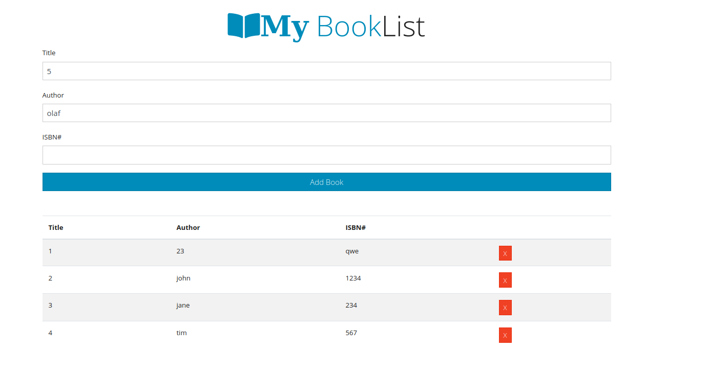

# Booklist-App

A static web page for rhythmic expression built with only HTML, CSS & JavaScript.

Try the live demo [right here](https://ayseakyol.github.io/booklist-app/#), it looks something like this:

---

## Notes

Studying this project I learned about:

* es6 classes
* Using the constructor
* Using static methods in classes

These resources were very helpful:

https://www.youtube.com/watch?v=2ZphE5HcQPQ

https://www.youtube.com/watch?v=RBLIm5LMrmc

---

> * Code refactored from [Traversy Media](https://www.youtube.com/watch?v=JaMCxVWtW58t)

